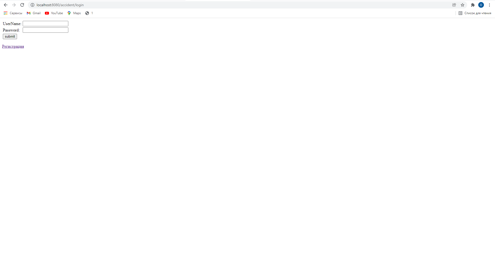
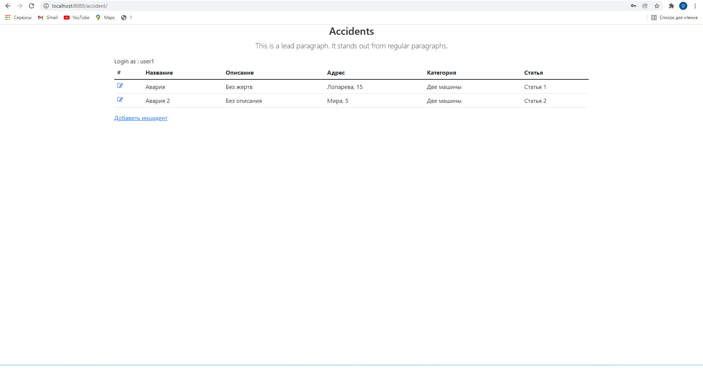
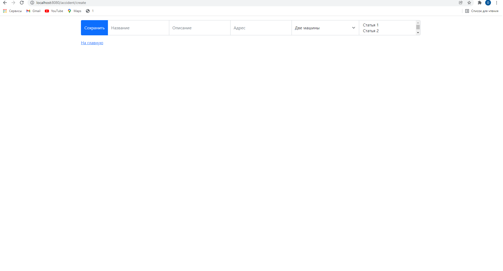

Car accident
=============
## Description
This project is the car accident message board;

### Used technologies:
#### Backend
1. Spring Web, Spring Data, Spring Security
2. Hibernate
3. PostgreSQL
#### Frontend
1. JSP
2. Bootstrap
### Functionality:
Login page

Main page

Adding new post

### Contact
If you have any questions, feel free to contact me: oleg.kolchin.j@gmail.com